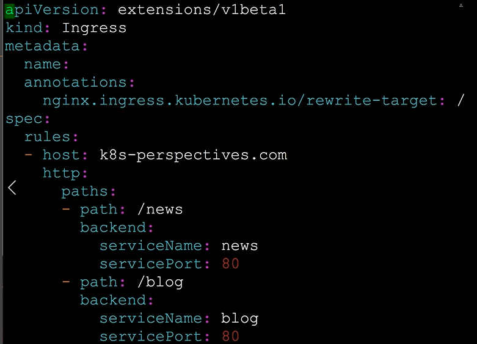

## Networking models 

One unique IP per Pod, Containers share the same IP and communicate via Localhost.

Services contain a logical set of Pod replicas identified with labels, that can be spread across labels. DNS service can be used to resolve names of services. ClusterIP is only reachable from withing the network. Nodeport allows outside to reach. Loadbalancer exposes the service through a providers loadbalancer. ExernalName is enabled by DNS, CNAME record is returned. Operate in OSI Layer 4.

Ingresses operate in OSI Layer 7. It can specify inbound rules, which support path-based routing, SSL termination, and load balancing. 



Check last applied deployments of a specific set.

``` bash 
kubectl apply view-last-applied deployments <name> > last-applied.yaml
```