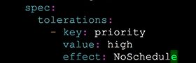
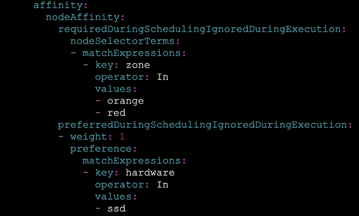
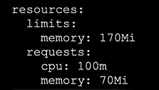

### Scheduling mastery

Daemonsets is a resource, it allows to create pods, one pod is running per node.

Taints are like nodelabels, they repel pods from nodes. Every pod scheduled on to a tainted node must have a toleration, which counteract taints. This allows you to schedule pods on specific nodes on a cluster. Kubernetes will taint a node if it runs low on specific resources that allow you to distribute pods evently based on utilization.

## Let's taint a node.

``` bash
kubectl taint node <node> priority=high:NoSchedule
```

Let's create nginx pods with 5 replicas

``` bash
kubectl create namespace scheduling
kubectl run nginx -n scheduling --image=nginx --replicas=5
```

Let's see where they landed.

``` bash
kubectl get pods -n scheduling --image=nginx --replicas=5
```

Tolerations.

``` bash
kubectl explain pods.spec.tolerations | more
```

Set tolerations 

``` bash
kubectl run nginx -n scheduling --image=nginx --replicas=5 -o=yaml --dry-run > toleration.yaml 
```

Set the toleration.



How to untaint a node.

``` bash
kubectl taint node <node> priority:NoSchedule-
```

## NodeSelector, will be deprecated and Node Affinity will take it's place



Required first, preferred are second defined. Terms are defined in match expressions.

## PodAffinity, similar to Node Affinity.

Conditions are on pod labels, but it's more computational expensive. They are also implicitly namespace based. Topology key controls which node/zone to schedule on.ű

You can map resources.

