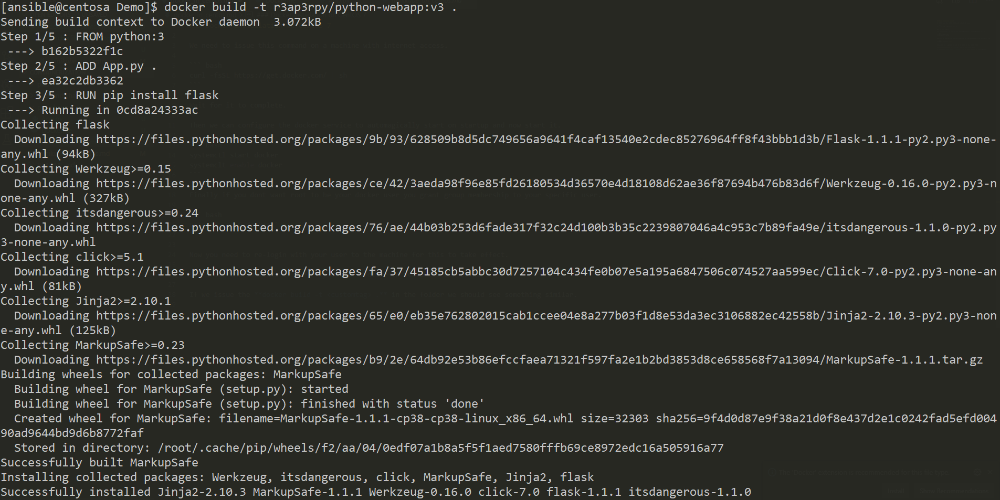

### Docker installation on CentOS 7

We need to issue this command on a machine with internet access.

``` bash
curl -fsSL https://get.docker.com/ | sh
```

Wait for it to complete.

Then we can configure the docker service to automagically start on startup and now start it.

``` bash
systemctl start docker
systemclt enable docker
``` 

Finally if you dont want root to be your docker user you grant group membership to your specific user.

``` bash
usermod -a -G docker `whoami`
```

Now you need to re-login with your user to the machine for this to take effect.

Let's use the contents of our **pywebapp** folder to testdrive our docker.

If we issue the **docker build -t <customname>:<customtag> .** in the folder we should see something similar.



Once this is done we can run our image.

Let's use the following command **docker run -d -p 8080:8080 <customname>:<customtag>**.

We should see something similar.


Testing the app is rather easy, with the **curl http://0.0.0.0:8080**, the response should look like this.

