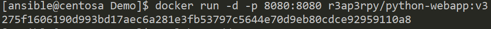
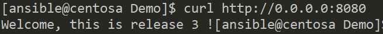

### Docker installation on CentOS 7

We need to issue this command on a machine with internet access.

``` bash
curl -fsSL https://get.docker.com/ | sh
```

Wait for it to complete.

Then we can configure the docker service to automagically start on startup and now start it.

``` bash
systemctl start docker
systemclt enable docker
``` 

Finally if you dont want root to be your docker user you grant group membership to your specific user.

``` bash
usermod -a -G docker `whoami`
```

Now you need to re-login with your user to the machine for this to take effect.

Let's use the contents of our **pywebapp** folder to testdrive our docker.

Create a folder called **webapp**, then navigate to it.

Let's create a file called **App.py** with the following content.

``` bash
from flask import Flask

app = Flask(__name__)

@app.route("/")
def index():
        return "The version 1 of the app!"

if __name__ == '__main__':
        app.run(host="0.0.0.0", port = 8080, debug = True)
```

Now we need a **Dockerfile** in the same directory with the following content.

``` bash
FROM python:3
ADD App.py .
RUN pip install flask
CMD ["python","App.py"]
```

This can now be build with the following command: **docker build -t r3ap3rpy/python-webapp:v1 .**

This should give you the following output, or something similar.

``` bash
Sending build context to Docker daemon  3.072kB
Step 1/4 : FROM python:3
 ---> 1f88553e8143
Step 2/4 : ADD App.py .
 ---> 5244cdd11905
Step 3/4 : RUN pip install flask
 ---> Running in 077098536ed4
Collecting flask
  Downloading https://files.pythonhosted.org/packages/9b/93/628509b8d5dc749656a9641f4caf13540e2cdec85276964ff8f43bbb1d3b/Flask-1.1.1-py2.py3-none-any.whl (94kB)
Collecting click>=5.1
  Downloading https://files.pythonhosted.org/packages/fa/37/45185cb5abbc30d7257104c434fe0b07e5a195a6847506c074527aa599ec/Click-7.0-py2.py3-none-any.whl (81kB)
Collecting Werkzeug>=0.15
  Downloading https://files.pythonhosted.org/packages/ce/42/3aeda98f96e85fd26180534d36570e4d18108d62ae36f87694b476b83d6f/Werkzeug-0.16.0-py2.py3-none-any.whl (327kB)
Collecting itsdangerous>=0.24
  Downloading https://files.pythonhosted.org/packages/76/ae/44b03b253d6fade317f32c24d100b3b35c2239807046a4c953c7b89fa49e/itsdangerous-1.1.0-py2.py3-none-any.whl
Collecting Jinja2>=2.10.1
  Downloading https://files.pythonhosted.org/packages/65/e0/eb35e762802015cab1ccee04e8a277b03f1d8e53da3ec3106882ec42558b/Jinja2-2.10.3-py2.py3-none-any.whl (125kB)
Collecting MarkupSafe>=0.23
  Downloading https://files.pythonhosted.org/packages/b9/2e/64db92e53b86efccfaea71321f597fa2e1b2bd3853d8ce658568f7a13094/MarkupSafe-1.1.1.tar.gz
Building wheels for collected packages: MarkupSafe
  Building wheel for MarkupSafe (setup.py): started
  Building wheel for MarkupSafe (setup.py): finished with status 'done'
  Created wheel for MarkupSafe: filename=MarkupSafe-1.1.1-cp38-cp38-linux_x86_64.whl size=32300 sha256=81138411aca2ce897c33ce6d0aeaf859d4894e44856fd2fc25eb9b90d4eca1d1
  Stored in directory: /root/.cache/pip/wheels/f2/aa/04/0edf07a1b8a5f5f1aed7580fffb69ce8972edc16a505916a77
Successfully built MarkupSafe
Installing collected packages: click, Werkzeug, itsdangerous, MarkupSafe, Jinja2, flask
Successfully installed Jinja2-2.10.3 MarkupSafe-1.1.1 Werkzeug-0.16.0 click-7.0 flask-1.1.1 itsdangerous-1.1.0
Removing intermediate container 077098536ed4
 ---> bb0b7857cf36
Step 4/4 : CMD ["python","App.py"]
 ---> Running in a2462673e62a
Removing intermediate container a2462673e62a
 ---> 348da70c06b2
Successfully built 348da70c06b2
Successfully tagged r3ap3rpy/python-webapp:v1
```
Now we can run push the container to the [DockerHUB](https://hub.docker.com/) to get something like [this](https://hub.docker.com/repository/docker/r3ap3rpy/python-webapp).

In order to do that we need to first login to the docker hub.

``` bash
[ansible@centosa webapp]$ docker login
Login with your Docker ID to push and pull images from Docker Hub. If you don't have a Docker ID, head over to https://hub.docker.com to create one.
Username: <username>
Password:
WARNING! Your password will be stored unencrypted in /home/ansible/.docker/config.json.
Configure a credential helper to remove this warning. See
https://docs.docker.com/engine/reference/commandline/login/#credentials-store

Login Succeeded
```

Now we can push the freshly created image to our public repository.
The command is : **docker push r3ap3rpy/python-webapp:v1** and the output looks like this.

``` bash
The push refers to repository [docker.io/r3ap3rpy/python-webapp]
e1ac4f4a0cfc: Pushed
be0cb0a1d0fe: Pushed
9f1e17ec9192: Layer already exists
98db0f6b946f: Layer already exists
c664d35d0409: Layer already exists
07aa3e497121: Layer already exists
f63773c65620: Layer already exists
e6d60910d056: Layer already exists
b52c1c103fae: Layer already exists
6f1c84e6ec59: Layer already exists
dd5242c2dc8a: Layer already exists
v1: digest: sha256:0e59dbd26d4cde48565faa0e0fbfc9cbae3b93987ee08bbcdea9c851c594920b size: 2635a
```

Let's use the following command **docker run -d -p 8080:8080 <customname>:<customtag>**.

We should see something similar.



Testing the app is rather easy, with the **curl http://0.0.0.0:8080**, the response should look like this.



### Tips and tricks below

You can set static IP for the container.

You need to run the container with **--net=host** argument.

You can inspect a container with.

**docker inspect <image>**

You can check session activity with.

**docker logs <image>**

You can check if a port is exposed with.

**docker port <image> <port>**

You can check image history.

**docker history <image>:<tag>**

You can paus or unpause containers.

**docker pause/unpause <image>**

## Docker network types
- --net=bridge (Bridged network)
- --net=host (host only network)
- --net=container:NAME (Direct link with the NAME container)
- --net=non (No network)

## Custom docker bridge with DHCP

Let's stop the docker service.

``` bash
systemctl stop docker
```

Issue the following commands.

``` bash
yum install bridge-utils -y
ip link set dev docker0 down
brctl delbr docker0
brctl addbr custom
ip addr add 192.168.0.1/24 dev custom
ip link set dev custom up
```

Then we edit the **/etc/docker/daemon.json** file and add the following line.

``` bash
{
    "bridge":"custom"
}
```

We can add custom network with custom DHCP addresses.

## Pretty reading the configuration.

``` bash
cat /var/lib/docker/repositories-aufs | python -mjson.tool
```