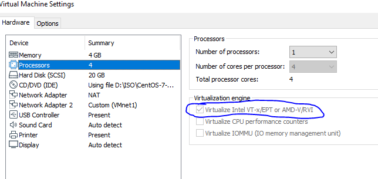
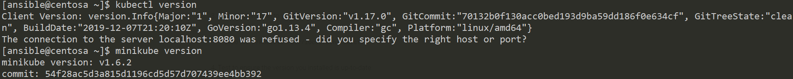
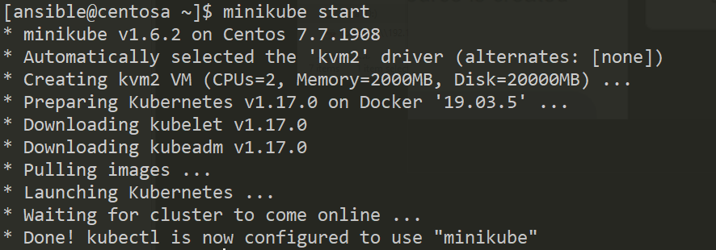
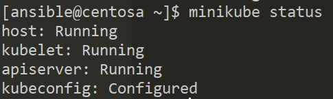
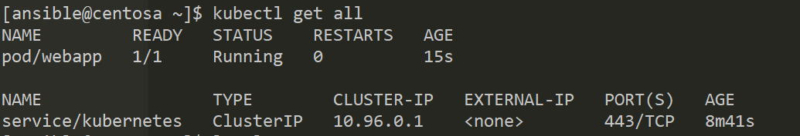

### Minukube on CentOS7 with VMWare Workstation.

You need to have a CentOS installed with at least 4vCPU and 4GB-s of RAM.

You also need to enable virtualization.



We need to have a user which is not root but has sudo access.

Download minikube.

``` bash
curl -Lo minikube https://storage.googleapis.com/minikube/releases/latest/minikube-linux-amd64 
sudo mv ./minikube /usr/local/bin/
sudo chmod +x /usr/local/bin/minikube
```

Download kubectl.

``` bash
curl -LO https://storage.googleapis.com/kubernetes-release/release/`curl -s https://storage.googleapis.com/kubernetes-release/release/stable.txt`/bin/linux/amd64/kubectl
sudo mv ./kubectl /usr/local/bin/
sudo chmod +x /usr/local/bin/kubectl
```

If we did everything correctly we should be able to issue the following commands, **minikube version** and **kubectl version**.

The output would be something like this.



Now let's install dependencies.

``` bash
sudo yum install qemu-kvm libvirt libvirt-python libguestfs-tools virt-install -y
```

Let's enable startup on boot for the **libvirtd** service, and start it now.

``` bash
systemctl enable libvirtd
systemctl start libvirtd
```

There is a catch however, you need to add your user to the **libvirt** group. 

``` bash
usermod --append --groups libvirt `whoami`
```

Now we are ready to start minikube with the **minikube start** command, after the system was rebooted.



You can get status of your minikube with the following command aswell.



Getting status of the kubernetes setup is done with **kubectl get all** command.



In order to apply a pod definition yaml you issue the following command.

``` bash
kubectl apply -f <filename.yaml>
```

Gather information about a pod.

``` bash
kubectl describe pod <name>
```

Get the IP of the minikube.

``` bash
minikube ip
```

Execute a command in a pod.

``` bash
kubectl exec <name> <command>
```

Open up an interactive shell.

``` bash
 kubectl -it exec <name> sh
```
